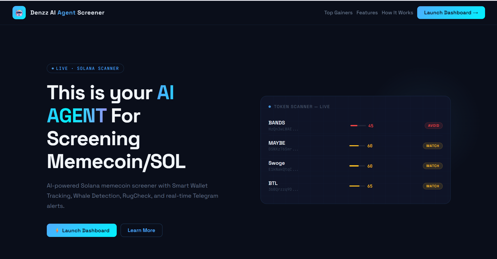
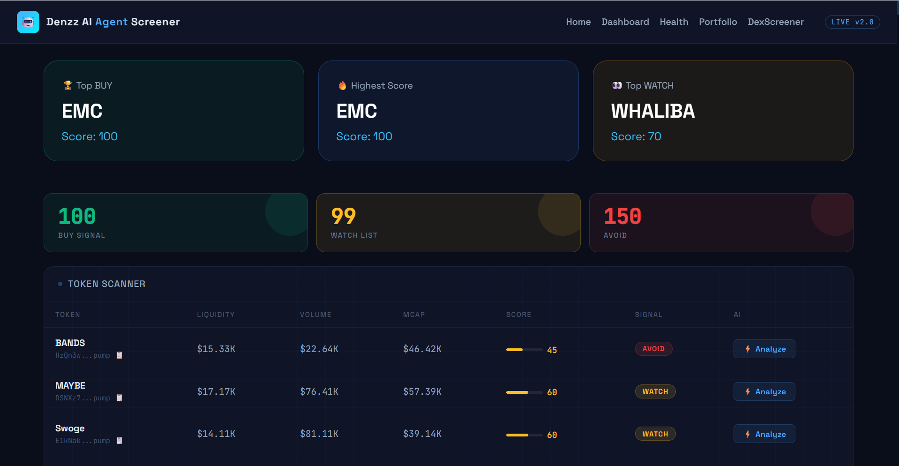
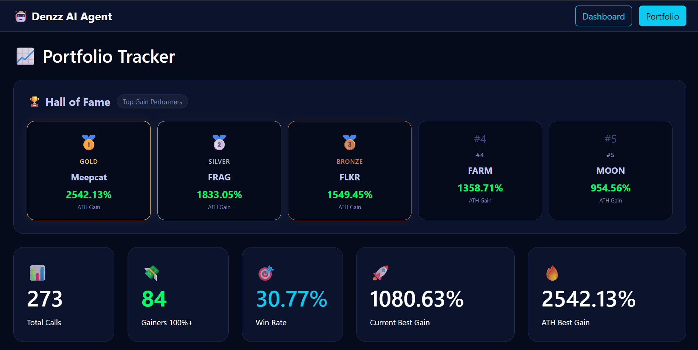

# 🚀 Memecoin AI Agent

AI-powered Solana Memecoin Screener built with Node.js, MySQL, Helius, DexScreener, RugCheck, and Telegram.

Automatically discovers new Solana memecoins, analyzes token quality, tracks smart wallets, performs AI analysis, and sends BUY/WATCH alerts directly to Telegram.

---

## ✨ Features

### 🔍 Token Discovery

* Scan newly listed Solana memecoins
* Discover trending tokens automatically
* Continuous monitoring

### 🧠 AI Analysis

* AI-generated token analysis
* BUY / WATCH / AVOID recommendations
* Groq support
* OpenRouter support

### 👛 Holder Analysis

* Top holder concentration detection
* Holder growth tracking
* Smart wallet participation analysis

### 🐋 Whale Detection

* Whale wallet tracking
* Large holder monitoring

### 🛡️ RugCheck Integration

* Rug score analysis
* Risk assessment
* Token safety checks

### 📊 Portfolio Tracker

* Entry MCAP tracking
* Current MCAP tracking
* ATH MCAP tracking
* Gain percentage calculation

### 🏆 Hall of Fame

* Best performing calls
* ATH gain leaderboard
* Portfolio statistics

### 🤖 Telegram Alerts

* BUY alerts
* WATCH alerts
* AI summaries
* Portfolio statistics

### ❤️ Health Monitor

* Scanner status
* API monitoring
* Database monitoring
* System health checks

---

## 📸 Screenshots

### Home Dashboard



### Scanner Dashboard



### Portfolio


.png)
.png)
.png)

---

## 🛠️ Tech Stack

* Node.js
* Express.js
* MySQL
* Helius API
* DexScreener API
* RugCheck API
* Telegram Bot API
* OpenRouter
* Groq

---

## 📋 Requirements

Before running the project, make sure you have:

* Node.js 18+
* MySQL 8+ (or MariaDB)
* Helius API Key
* Telegram Bot Token
* OpenRouter API Key or Groq API Key

---

## ⚙️ Installation

### Clone Repository

```bash
git clone https://github.com/Denzz102/memecoin-agent.git

cd memecoin-agent
```

### Install Dependencies

```bash
npm install
```

### Create Database

```sql
CREATE DATABASE memecoin_agent;
```

### Import Schema

```bash
mysql -u root -p memecoin_agent < database/schema.sql
```

For complete installation instructions, see:

```text
docs/INSTALLATION.md
```

---

## 🔑 Environment Variables

Create a `.env` file based on `.env.example`.

Example:

```env
HELIUS_API_KEY=

OPENROUTER_API_KEY=
# OR
GROQ_API_KEY=

TELEGRAM_BOT_TOKEN=
TELEGRAM_CHAT_ID=

DB_HOST=localhost
DB_USER=root
DB_PASSWORD=
DB_NAME=memecoin_agent
```

---

## ▶️ Run Application

```bash
node server.js
```

or

```bash
npm start
```

---

## 🌐 Dashboard

Main Dashboard:

```text
http://localhost:3000
```

Portfolio:

```text
http://localhost:3000/portfolio
```

Health Monitor:

```text
http://localhost:3000/health
```

---

## 📁 Project Structure

```text
memecoin-agent/
├── config/
├── database/
│   └── schema.sql
├── docs/
│   └── INSTALLATION.md
├── logs/
├── public/
├── routes/
├── services/
├── screenshots/
├── .env.example
├── .gitignore
├── package.json
├── package-lock.json
├── server.js
└── README.md
```

---

## 📊 Database Tables

* tokens
* signals
* smart_wallets
* token_history
* portfolio

---

## 🔔 Telegram Features

* BUY Alerts
* WATCH Alerts
* Token Analysis
* Portfolio Statistics
* Hall of Fame

---

## 🚀 Deployment

Supported environments:

* Localhost
* VPS
* Ubuntu Server
* Windows Server

Recommended stack:

* Ubuntu 22.04
* PM2
* Nginx
* MySQL 8

---

## 📚 Documentation

Additional documentation:

* Installation Guide → `docs/INSTALLATION.md`

---

## ⚠️ Disclaimer

This software is provided for educational and research purposes only.

Memecoin trading involves significant risk. Always conduct your own research before making investment decisions.

The author is not responsible for financial losses resulting from the use of this software.

---

## 📜 License

MIT License

Feel free to fork, modify, and improve this project.

---

## ❤️ Support the Project

Enjoying Memecoin AI Agent?

If this project has been helpful to you, feel free to support its development with a voluntary donation.

☀️ Solana (SOL)

H515J4mCY9tmAfv6uvHqUfQdHqoQCr78AaBFjgXBpnd5

Thank you for your support 🚀

